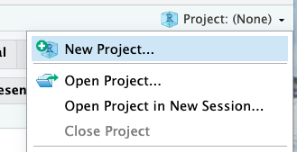
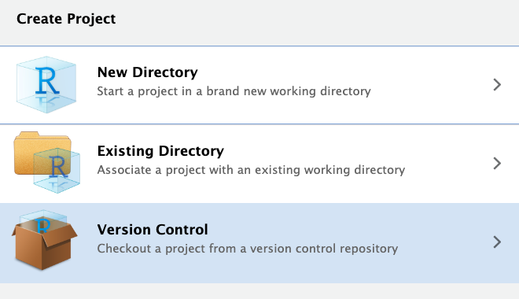
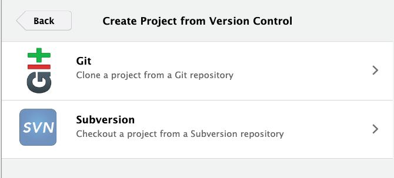
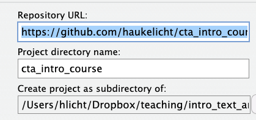

# Introduction to computational text analysis


This Github repository accompanies the VU "Introduction to computational text analysis" taught by Hauke Licht (hauke.licht@uibk.ac.at) at the University of Innsbruck.

Participants must **complete the computer setup** described below before the course


## Computer setup

### 1. Install/update R and RStudio

Participants must have running installations of the **_R_** programming languages and the **_RStudio_** integrated development environment (IDE) at the beginning of the course.

- Please follow the instructions at https://posit.co/download/rstudio-desktop to install R and RStudio.
- Verify that you have at least R 4.2.0 by running the following line in R(studio):
  ```R
  R.version[["version.string"]]
  ```
- Verify that you have at least RStudio version 2023.12 by running the following line in R(studio):
  ```R
  rstudioapi::versionInfo()$version
  ```
- To keep course materials up-to-date on your computer, you also require a **Git** installation (see [here](https://rfortherestofus.com/2021/02/how-to-use-git-github-with-r) and [here](https://happygitwithr.com/rstudio-git-github.html)). A user-friendly option is using the [**_Github Desktop app_**](https://docs.github.com/en/desktop/installing-and-authenticating-to-github-desktop/installing-github-desktop) For alternatives, see [here](https://happygitwithr.com/install-git#install-git), incl. installation instructions. _Note @ Windows users_: I recommend using Github Desktop or [_Git for Windwows_](https://gitforwindows.org/).

Please contact the instructor (hauke.licht@uibk.ac.at) should you encounter issues or errors during setup.

### 2. Clone this repository from Github to your local computer


| Step | Description | Screenshot  |
| ----:|:----------- |:--:|
| 1. | Open the RStudio App on your computer | |
| 2. | Begin creating a new project |   |
| 3. | Choose creating from "Version control" option |   |
| 4. | Choose "Git" option |   |
| 5. | Insert `https://github.com/haukelicht/cta_intro_course.git` as "Repository URL", use `cta_intro_course` as "Project directory name", and choose a location on your computer |   |

### 3. setup `renv` and install the required packages

1. Open the file [setup.R](./setup.R)
2. Run the R script by clicking "Run" or pressing ⌘ + ⏎ (macOS) or Ctrl+Enter (Windows)


